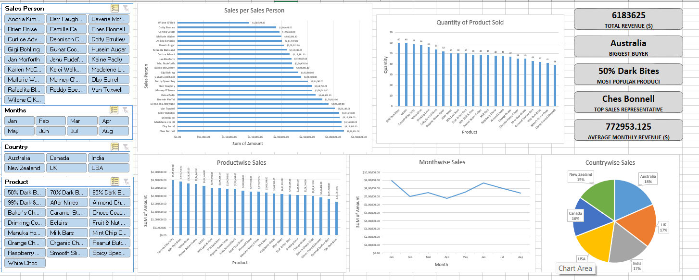

# Sales KPI Analysis Dashboard

## Overview
This project analyzes sales performance across countries, products, and sales representatives using an interactive Excel dashboard.

## Key Features
- Total Revenue KPI
- Average Monthly Revenue
- Top Sales Representative (by revenue)
- Biggest Buyer (Country by revenue)
- Most Popular Product (by quantity sold)
- Interactive slicers (Month, Country, Product, Sales Person)
- Revenue and Quantity trend analysis

## Tools Used
- Microsoft Excel
- Pivot Tables
- Slicers
- GETPIVOTDATA
- KPI Cards using Shapes

## Dashboard Preview

## Insights
- Australia contributes the highest revenue share.
- Raspberry Choco is the most popular product by quantity.
- Revenue peaks in March driven by top-performing sales reps.
